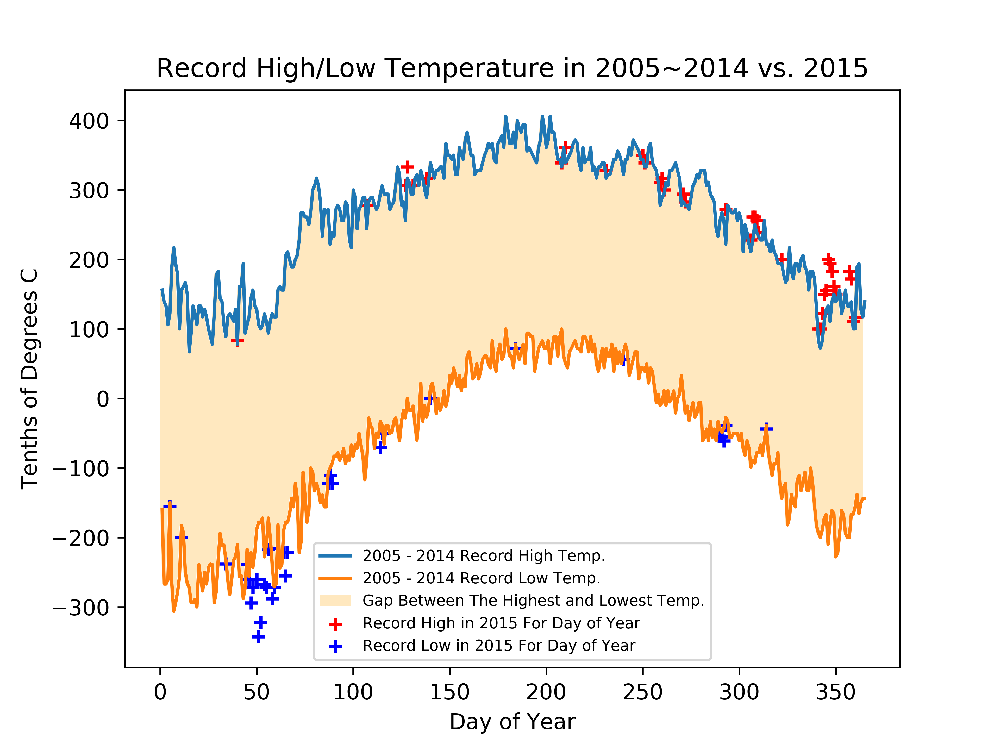

# Assignment 2

Before working on this assignment please read these instructions fully. In the submission area, you will notice that you can click the link to **Preview the Grading** for each step of the assignment. This is the criteria that will be used for peer grading. Please familiarize yourself with the criteria before beginning the assignment.

An NOAA dataset has been stored in the file `data/C2A2_data/BinnedCsvs_d400/fb441e62df2d58994928907a91895ec62c2c42e6cd075c2700843b89.csv`. The data for this assignment comes from a subset of The National Centers for Environmental Information (NCEI) [Daily Global Historical Climatology Network](https://www1.ncdc.noaa.gov/pub/data/ghcn/daily/readme.txt) (GHCN-Daily). The GHCN-Daily is comprised of daily climate records from thousands of land surface stations across the globe.

Each row in the assignment datafile corresponds to a single observation.

The following variables are provided to you:

* **id** : station identification code
* **date** : date in YYYY-MM-DD format (e.g. 2012-01-24 = January 24, 2012)
* **element** : indicator of element type
    * TMAX : Maximum temperature (tenths of degrees C)
    * TMIN : Minimum temperature (tenths of degrees C)
* **value** : data value for element (tenths of degrees C)

For this assignment, you must:

1. Read the documentation and familiarize yourself with the dataset, then write some python code which returns a line graph of the record high and record low temperatures by day of the year over the period 2005-2014. The area between the record high and record low temperatures for each day should be shaded.
2. Overlay a scatter of the 2015 data for any points (highs and lows) for which the ten year record (2005-2014) record high or record low was broken in 2015.
3. Watch out for leap days (i.e. February 29th), it is reasonable to remove these points from the dataset for the purpose of this visualization.
4. Make the visual nice! Leverage principles from the first module in this course when developing your solution. Consider issues such as legends, labels, and chart junk.

The data you have been given is near **Ann Arbor, Michigan, United States**, and the stations the data comes from are shown on the map below.

## Setup Environment


```python
%matplotlib notebook
import matplotlib.pyplot as plt
import pandas as pd
import numpy as np
```

## Load Dataset


```python
data = pd.read_csv('fb441e62df2d58994928907a91895ec62c2c42e6cd075c2700843b89.csv')
print(data.shape)
data.head()
```

    (165085, 4)


<div>
<style scoped>
    .dataframe tbody tr th:only-of-type {
        vertical-align: middle;
    }

    .dataframe tbody tr th {
        vertical-align: top;
    }
    
    .dataframe thead th {
        text-align: right;
    }
</style>
<table border="1" class="dataframe">
  <thead>
    <tr style="text-align: right;">
      <th></th>
      <th>ID</th>
      <th>Date</th>
      <th>Element</th>
      <th>Data_Value</th>
    </tr>
  </thead>
  <tbody>
    <tr>
      <th>0</th>
      <td>USW00094889</td>
      <td>2014-11-12</td>
      <td>TMAX</td>
      <td>22</td>
    </tr>
    <tr>
      <th>1</th>
      <td>USC00208972</td>
      <td>2009-04-29</td>
      <td>TMIN</td>
      <td>56</td>
    </tr>
    <tr>
      <th>2</th>
      <td>USC00200032</td>
      <td>2008-05-26</td>
      <td>TMAX</td>
      <td>278</td>
    </tr>
    <tr>
      <th>3</th>
      <td>USC00205563</td>
      <td>2005-11-11</td>
      <td>TMAX</td>
      <td>139</td>
    </tr>
    <tr>
      <th>4</th>
      <td>USC00200230</td>
      <td>2014-02-27</td>
      <td>TMAX</td>
      <td>-106</td>
    </tr>
  </tbody>
</table>
</div>


### Converting the date column to date types

Read the documentation and familiarize yourself with the dataset, then write some python code which returns a line graph of the record high and record low temperatures by day of the year over the period 2005-2014. The area between the record high and record low temperatures for each day should be shaded.


```python
data["Date"] = pd.to_datetime(data["Date"]) # Converting date column into datetime format in pandas
```

For this analysis purpos, I'm going to drop the data that fall into leap year data (Febrary 29th) to simplify the graph.


```python
data = data[~((data["Date"].dt.month == 2) & (data["Date"].dt.day == 29))]
```

### Seperating data set into two (TMAX , TMIN)


```python
dataTmax = data[data["Element"] == 'TMAX']
dataTmin = data[data["Element"] == 'TMIN']
```


```python
### Dropping the column because it's unnecessary anymore
```


```python
dataTmax = dataTmax.drop('Element', axis = 1)
dataTmin = dataTmin.drop('Element', axis = 1)
```

Because some of the data missing tmax or tmin within the same ID, I'm going to use the data that has both data in it. To do that, I'm merging the two separate data set into one using inner join. 


```python

dataMerged = pd.merge(dataTmax, dataTmin, how = 'inner', left_on = ['ID','Date'], right_on = ['ID','Date'])
```


```python
dataMerged.head()
```


<div>
<style scoped>
    .dataframe tbody tr th:only-of-type {
        vertical-align: middle;
    }

    .dataframe tbody tr th {
        vertical-align: top;
    }
    
    .dataframe thead th {
        text-align: right;
    }
</style>
<table border="1" class="dataframe">
  <thead>
    <tr style="text-align: right;">
      <th></th>
      <th>ID</th>
      <th>Date</th>
      <th>Data_Value_x</th>
      <th>Data_Value_y</th>
    </tr>
  </thead>
  <tbody>
    <tr>
      <th>0</th>
      <td>USW00094889</td>
      <td>2014-11-12</td>
      <td>22</td>
      <td>-27</td>
    </tr>
    <tr>
      <th>1</th>
      <td>USC00200032</td>
      <td>2008-05-26</td>
      <td>278</td>
      <td>172</td>
    </tr>
    <tr>
      <th>2</th>
      <td>USC00205563</td>
      <td>2005-11-11</td>
      <td>139</td>
      <td>0</td>
    </tr>
    <tr>
      <th>3</th>
      <td>USC00200230</td>
      <td>2014-02-27</td>
      <td>-106</td>
      <td>-156</td>
    </tr>
    <tr>
      <th>4</th>
      <td>USW00014833</td>
      <td>2010-10-01</td>
      <td>194</td>
      <td>50</td>
    </tr>
  </tbody>
</table>
</div>


```python
dataMerged.columns = ['ID','Date','TMAX', 'TMIN']
```


```python
dataMerged2005 = dataMerged[dataMerged['Date'].dt.year == 2005]
```

Pivotting data set to make it more appropriate for the analysis. 


```python
dataMergedPivot = pd.pivot_table(dataMerged, index = 'Date', values = ['TMAX','TMIN'], aggfunc = ['max','min'])
```


```python
dataMergedPivot = dataMergedPivot.loc[:,[('max','TMAX'),('min','TMIN')]]
```


```python
dataMergedPivot.columns = ['TMAX','TMIN']
```


```python
dataMergedPivot
```


<div>
<style scoped>
    .dataframe tbody tr th:only-of-type {
        vertical-align: middle;
    }

    .dataframe tbody tr th {
        vertical-align: top;
    }
    
    .dataframe thead th {
        text-align: right;
    }
</style>
<table border="1" class="dataframe">
  <thead>
    <tr style="text-align: right;">
      <th></th>
      <th>TMAX</th>
      <th>TMIN</th>
    </tr>
    <tr>
      <th>Date</th>
      <th></th>
      <th></th>
    </tr>
  </thead>
  <tbody>
    <tr>
      <th>2005-01-01</th>
      <td>156</td>
      <td>-56</td>
    </tr>
    <tr>
      <th>2005-01-02</th>
      <td>133</td>
      <td>-56</td>
    </tr>
    <tr>
      <th>2005-01-03</th>
      <td>133</td>
      <td>0</td>
    </tr>
    <tr>
      <th>2005-01-04</th>
      <td>39</td>
      <td>-39</td>
    </tr>
    <tr>
      <th>2005-01-05</th>
      <td>33</td>
      <td>-94</td>
    </tr>
    <tr>
      <th>2005-01-06</th>
      <td>0</td>
      <td>-106</td>
    </tr>
    <tr>
      <th>2005-01-07</th>
      <td>6</td>
      <td>-111</td>
    </tr>
    <tr>
      <th>2005-01-08</th>
      <td>17</td>
      <td>-100</td>
    </tr>
    <tr>
      <th>2005-01-09</th>
      <td>28</td>
      <td>-67</td>
    </tr>
    <tr>
      <th>2005-01-10</th>
      <td>44</td>
      <td>-56</td>
    </tr>
    <tr>
      <th>2005-01-11</th>
      <td>44</td>
      <td>-22</td>
    </tr>
    <tr>
      <th>2005-01-12</th>
      <td>139</td>
      <td>-17</td>
    </tr>
    <tr>
      <th>2005-01-13</th>
      <td>161</td>
      <td>-83</td>
    </tr>
    <tr>
      <th>2005-01-14</th>
      <td>150</td>
      <td>-128</td>
    </tr>
    <tr>
      <th>2005-01-15</th>
      <td>-33</td>
      <td>-144</td>
    </tr>
    <tr>
      <th>2005-01-16</th>
      <td>-33</td>
      <td>-150</td>
    </tr>
    <tr>
      <th>2005-01-17</th>
      <td>-50</td>
      <td>-189</td>
    </tr>
    <tr>
      <th>2005-01-18</th>
      <td>-39</td>
      <td>-217</td>
    </tr>
    <tr>
      <th>2005-01-19</th>
      <td>11</td>
      <td>-300</td>
    </tr>
    <tr>
      <th>2005-01-20</th>
      <td>11</td>
      <td>-156</td>
    </tr>
    <tr>
      <th>2005-01-21</th>
      <td>-39</td>
      <td>-178</td>
    </tr>
    <tr>
      <th>2005-01-22</th>
      <td>-72</td>
      <td>-178</td>
    </tr>
    <tr>
      <th>2005-01-23</th>
      <td>-61</td>
      <td>-250</td>
    </tr>
    <tr>
      <th>2005-01-24</th>
      <td>11</td>
      <td>-267</td>
    </tr>
    <tr>
      <th>2005-01-25</th>
      <td>28</td>
      <td>-228</td>
    </tr>
    <tr>
      <th>2005-01-26</th>
      <td>28</td>
      <td>-206</td>
    </tr>
    <tr>
      <th>2005-01-27</th>
      <td>6</td>
      <td>-239</td>
    </tr>
    <tr>
      <th>2005-01-28</th>
      <td>-11</td>
      <td>-250</td>
    </tr>
    <tr>
      <th>2005-01-29</th>
      <td>17</td>
      <td>-222</td>
    </tr>
    <tr>
      <th>2005-01-30</th>
      <td>28</td>
      <td>-217</td>
    </tr>
    <tr>
      <th>...</th>
      <td>...</td>
      <td>...</td>
    </tr>
    <tr>
      <th>2015-12-02</th>
      <td>100</td>
      <td>-61</td>
    </tr>
    <tr>
      <th>2015-12-03</th>
      <td>94</td>
      <td>-78</td>
    </tr>
    <tr>
      <th>2015-12-04</th>
      <td>94</td>
      <td>-43</td>
    </tr>
    <tr>
      <th>2015-12-05</th>
      <td>94</td>
      <td>-50</td>
    </tr>
    <tr>
      <th>2015-12-06</th>
      <td>100</td>
      <td>-56</td>
    </tr>
    <tr>
      <th>2015-12-07</th>
      <td>100</td>
      <td>-67</td>
    </tr>
    <tr>
      <th>2015-12-08</th>
      <td>100</td>
      <td>-67</td>
    </tr>
    <tr>
      <th>2015-12-09</th>
      <td>122</td>
      <td>-33</td>
    </tr>
    <tr>
      <th>2015-12-10</th>
      <td>150</td>
      <td>-44</td>
    </tr>
    <tr>
      <th>2015-12-11</th>
      <td>156</td>
      <td>0</td>
    </tr>
    <tr>
      <th>2015-12-12</th>
      <td>200</td>
      <td>28</td>
    </tr>
    <tr>
      <th>2015-12-13</th>
      <td>194</td>
      <td>67</td>
    </tr>
    <tr>
      <th>2015-12-14</th>
      <td>183</td>
      <td>61</td>
    </tr>
    <tr>
      <th>2015-12-15</th>
      <td>161</td>
      <td>39</td>
    </tr>
    <tr>
      <th>2015-12-16</th>
      <td>150</td>
      <td>6</td>
    </tr>
    <tr>
      <th>2015-12-17</th>
      <td>122</td>
      <td>-11</td>
    </tr>
    <tr>
      <th>2015-12-18</th>
      <td>33</td>
      <td>-50</td>
    </tr>
    <tr>
      <th>2015-12-19</th>
      <td>11</td>
      <td>-67</td>
    </tr>
    <tr>
      <th>2015-12-20</th>
      <td>83</td>
      <td>-94</td>
    </tr>
    <tr>
      <th>2015-12-21</th>
      <td>122</td>
      <td>-83</td>
    </tr>
    <tr>
      <th>2015-12-22</th>
      <td>133</td>
      <td>6</td>
    </tr>
    <tr>
      <th>2015-12-23</th>
      <td>183</td>
      <td>0</td>
    </tr>
    <tr>
      <th>2015-12-24</th>
      <td>172</td>
      <td>0</td>
    </tr>
    <tr>
      <th>2015-12-25</th>
      <td>111</td>
      <td>-32</td>
    </tr>
    <tr>
      <th>2015-12-26</th>
      <td>117</td>
      <td>-39</td>
    </tr>
    <tr>
      <th>2015-12-27</th>
      <td>83</td>
      <td>-6</td>
    </tr>
    <tr>
      <th>2015-12-28</th>
      <td>61</td>
      <td>-39</td>
    </tr>
    <tr>
      <th>2015-12-29</th>
      <td>100</td>
      <td>-39</td>
    </tr>
    <tr>
      <th>2015-12-30</th>
      <td>67</td>
      <td>-22</td>
    </tr>
    <tr>
      <th>2015-12-31</th>
      <td>17</td>
      <td>-56</td>
    </tr>
  </tbody>
</table>
<p>4015 rows × 2 columns</p>
</div>


### Daily Comparison

What we are truely interested in is the daily high and low record through out the dacade. So I'm converting the data. 


```python
dataMerged = pd.merge(dataTmax, dataTmin, how = 'inner', left_on = ['ID','Date'], right_on = ['ID','Date'])
```


```python
dataMerged.columns = ['ID','Date','TMAX', 'TMIN']
```


```python
dataMerged['Year'] = dataMerged['Date'].dt.year
dataMerged['Month'] = dataMerged['Date'].dt.month
dataMerged['Day'] = dataMerged['Date'].dt.day
dataMerged['DayofYear'] = dataMerged['Date'].dt.dayofyear

```


```python
dataMerged2015 = dataMerged[dataMerged['Year'] == 2015]
```


```python
dataMerged = dataMerged[dataMerged['Year'] != 2015]
```

Because I discarded leap day, setting offset day by -1 after March.


```python
dataMerged.loc[(dataMerged["Date"].dt.is_leap_year)&(dataMerged["Month"] > 2), "DayofYear"] =\
dataMerged.loc[(dataMerged["Date"].dt.is_leap_year)&(dataMerged["Month"] > 2), "DayofYear"] - 1
```


```python
dataMergedPivot = pd.pivot_table(dataMerged, index = 'DayofYear', 
                                 values = ['TMAX','TMIN'], aggfunc = ['max','min'])
dataMergedPivot = dataMergedPivot.loc[:,[('max','TMAX'),('min','TMIN')]]
dataMergedPivot.columns = ['TMAX','TMIN']
```


```python
dataMergedPivot2015 = pd.pivot_table(dataMerged2015, index = 'DayofYear', 
                                 values = ['TMAX','TMIN'], aggfunc = ['max','min'])
dataMergedPivot2015 = dataMergedPivot2015.loc[:,[('max','TMAX'),('min','TMIN')]]
dataMergedPivot2015.columns = ['TMAX','TMIN']

```

Finding days that are with higher temperature than the record high and record low. 


```python
hotterDays = dataMergedPivot2015[dataMergedPivot['TMAX'] < dataMergedPivot2015['TMAX']]
```


```python
colderDays = dataMergedPivot2015[dataMergedPivot['TMIN'] > dataMergedPivot2015['TMIN']]
```

Graph Function


```python
def tempRecordGraph(dataMergedPivot):
    plt.figure()
    plt.plot(dataMergedPivot['TMAX'], '-',
             dataMergedPivot['TMIN'], '-')
    plt.gca().fill_between(range(len(dataMergedPivot)), 
                       dataMergedPivot['TMIN'], dataMergedPivot['TMAX'], 
                       facecolor='orange', 
                       alpha=0.25)
    plt.scatter(hotterDays.index,hotterDays["TMAX"], c = 'red', marker = '+')
    plt.scatter(colderDays.index,colderDays["TMIN"], c = 'blue',marker = '+')
    plt.legend(['2005 - 2014 Record High Temp.', '2005 - 2014 Record Low Temp.', 
            'Gap Between The Highest and Lowest Temp.', 
            'Record High in 2015 For Day of Year', 'Record Low in 2015 For Day of Year'], loc = 0, fontsize = 7)
    plt.xlabel("Day of Year")
    plt.ylabel("Tenths of Degrees C")
    plt.title('Record High/Low Temperature in 2005~2014 vs. 2015')
    plt.savefig("assignment2.png", dpi = 600,quality = 95)
```


```python
tempRecordGraph(dataMergedPivot)
```


    <IPython.core.display.Javascript object>





```python

```
